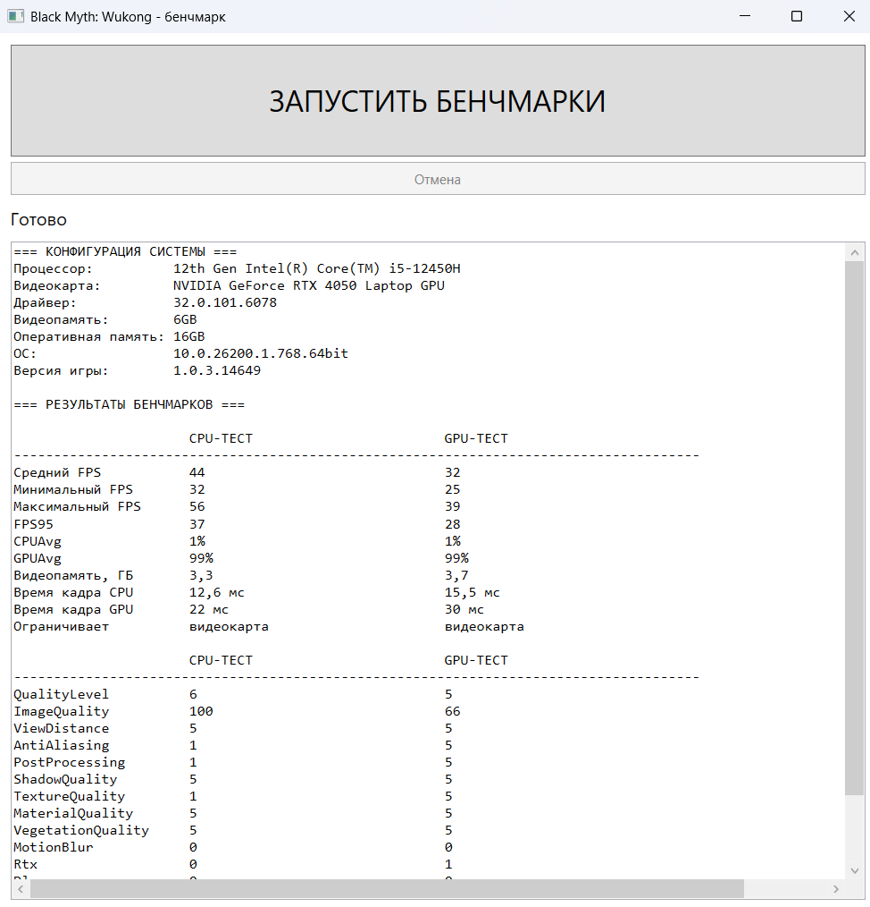

# Wukong Benchmark Runner

Небольшое WPF-приложение на C# для автоматического запуска **Black Myth: Wukong Benchmark Tool** с двумя наборами настроек и формирования текстового отчёта с результатами.

## Что делает программа

Программа применяет зараннее подготовленные профили графических параметров при запуске CPU и GPU тестов, а затем формирует отчет с их сравнением и сериализует его в отдельный файл.

Настройки сохраняются в файл: `GameUserSettings.ini`

Результаты тестирования берутся из папки: `$env:TEMP\b1\BenchMarkHistory\Tool`

Результат сохраняется в файл: `eport_YYYYMMDD_HHmmss.txt1`

## Используемые параметры

Для каждого теста используется отдельный профиль.

Однако DLSS и Frame Generation отключены в обоих тестах, чтобы результаты можно было напрямую сравнивать по времени обработки кадра CPU и GPU.

### CPU-тест

Цель CPU-теста — максимально снизить нагрузку на видеокарту и одновременно оставить высокую нагрузку на CPU.

Низкое разрешение, отключённый RTX и минимальные GPU-зависимые настройки уменьшают нагрузку на видеокарту. При этом дальность прорисовки, тени, растительность, эффекты и материалы устанавливаются на максимальный уровень, чтобы увеличить нагрузку на процессор.

### GPU-тест

Цель GPU-теста — создать высокую нагрузку на видеокарту.

В GPU-тесте большинство графических параметров устанавливается на максимальный уровень, включается RTX, а разрешение увеличивается до 1920×1080.


## Определение узкого места

Для определения bottleneck используются времена обработки кадра:

```text
CPU Frame Time
GPU Frame Time
```

Если:

```text
CPU Frame Time > GPU Frame Time
```

то ограничивающим компонентом считается **CPU**, а если наоборот, то **GPU**

Например:

```text
CPU Frame Time: 11.1 ms
GPU Frame Time: 17.8 ms
```

означает, что видеокарта является ограничивающим компонентом.

## Используемая конфигурация

Программа рассчитана на локальную установку Benchmark Tool, а первоначальные данные вручную записываются в `appsettings.json`

```text
D:\SteamLibrary\steamapps\common\Black Myth Wukong Benchmark Tool
```

Результаты Benchmark Tool читаются из:

```text
%TEMP%\b1\BenchMarkHistory\Tool
```

Настройки игры изменяются в:

```text
b1\Saved\Config\Windows\GameUserSettings.ini
```

# Результаты


